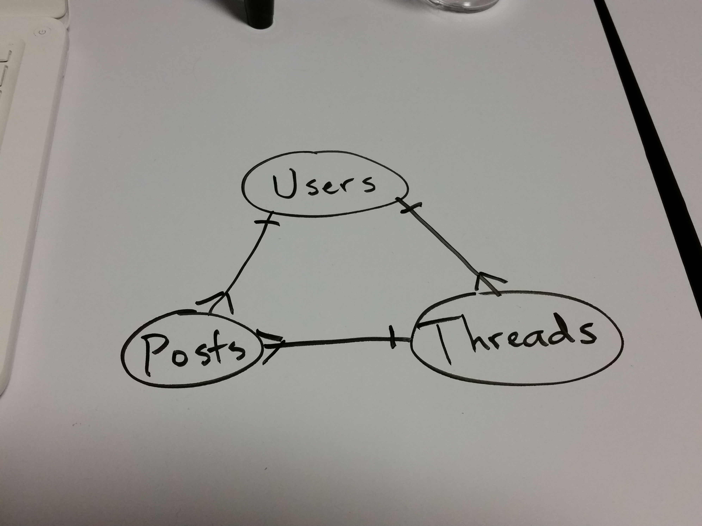

#The Forum

This is a general-purpose forum where users can create threads and posts on whatever topic they like.

The above description just covered the three models in this app: `User`, `Post`, and `Thread`. Relationships are diagrammed below.

 

Features in mind are:

- Multimedia posts (images, sound, video)
- Moderators and admins who can remove any post and ban any normal user
- Ability to draw on post (if there's time)
- Preventing invalid emails and usernames from being set during account creation
- Recaptcha button on account creation
- Lots of CSS, SASS, and Bootstrap to make the site look really good
- Drag-and-drop to upload files